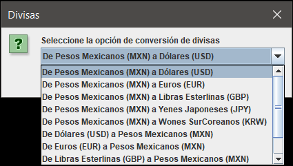
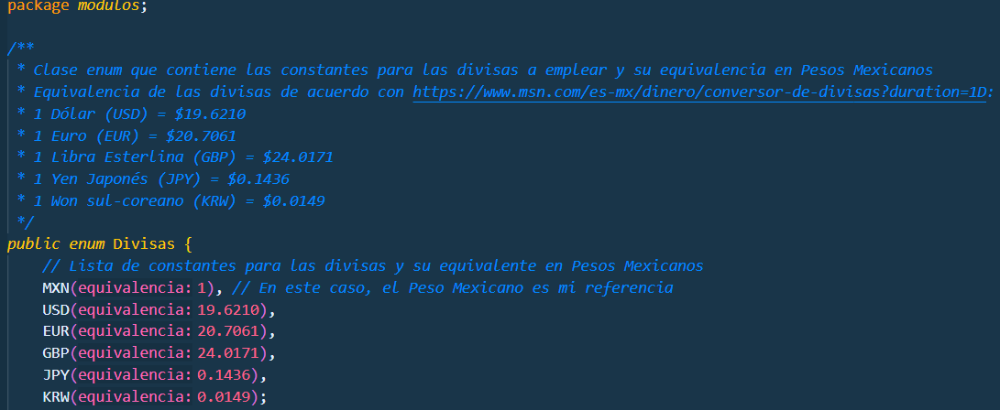

# ConversorJava

Este es un proyecto simple que ejecuta diferentes conversores programados mediante lenguaje Java.

Emplea diferentes objetos JOptionPanel para desplegar una interfaz sencilla que guía al usuario.

Actualmente tiene dos módulos: Conversor de Divisas y Conversor de Temperatura.

Una vez elegido se solicita un valor que debe ser numérico:

Después se despliega el menú desplegable para seleccionar la conversión deseada:

Y se muestra el resultado:

En caso de que se haya introducido una entrada no numérica se captura e indica el error:

Finalmente, se pregunta al usuario si desea permanecer en el módulo y repetirlo, o permanecer en el programa y repetirlo.
De seleccionar las opciones Cancelar, salta el mensaje de finalización:

Algo a destacar es que, al traterse de constantes (aún con las divisas), se crearon clases de tipo "enum" para manejarlas:

